# Sơ đồ use case tổng quan

> **Hệ thống:** Website Thương mại điện tử Thời trang (FREYA Fashion Shop)
> **Phiên bản:** Sprint 1 – 14/09/2026
> **Người lập:** Phan Ngọc Duy (HT-04)
>
> Sơ đồ Mermaid dưới đây hiển thị trực tiếp trên GitHub.
> File draw.io đầy đủ với đầy đủ quan hệ `<<include>>`/`<<extend>>` ở cùng thư mục: `uc-tong-quan.drawio.png`.

---

## Sơ đồ tổng quan theo tác nhân

```mermaid
graph LR
    %% ===== ACTORS =====
    KVL(["Khách vãng lai"])
    KH(["Khách hàng"])
    NV(["Nhân viên"])
    QTV(["Quản trị viên"])
    SHP(["Shipper"])
    CTT(["Cổng thanh toán"])

    %% ===== PH-01: Tài khoản & Xác thực =====
    subgraph PH01["PH-01 · Tài khoản & Xác thực"]
        UC0101("PH-01.1 Đăng ký tài khoản")
        UC0102("PH-01.2 Đăng nhập")
        UC0103("PH-01.3 Đặt lại mật khẩu")
        UC0104("PH-01.4 Đăng xuất")
        UC0105("PH-01.5 Cập nhật thông tin cá nhân")
        UC0106("PH-01.6 Quản lý địa chỉ giao hàng")
        UC0107("PH-01.7 Cập nhật hồ sơ vóc dáng")
    end

    %% ===== PH-02: Quản trị tài khoản =====
    subgraph PH02["PH-02 · Quản trị tài khoản"]
        UC0201("PH-02.1 Quản lý tài khoản người dùng")
        UC0202("PH-02.2 Quản lý nhân viên & phân quyền")
    end

    %% ===== PH-03: Khám phá sản phẩm =====
    subgraph PH03["PH-03 · Khám phá sản phẩm"]
        UC0301("PH-03.1 Duyệt danh mục")
        UC0302("PH-03.2 Tìm kiếm sản phẩm")
        UC0303("PH-03.3 Lọc & sắp xếp")
        UC0304("PH-03.4 Xem chi tiết sản phẩm")
        UC0305("PH-03.5 Xem hướng dẫn chọn size")
    end

    %% ===== PH-04: Quản lý sản phẩm =====
    subgraph PH04["PH-04 · Quản lý danh mục & Sản phẩm"]
        UC0401("PH-04.1 Quản lý danh mục")
        UC0402("PH-04.2 Quản lý sản phẩm")
        UC0403("PH-04.3 Quản lý biến thể & SKU")
        UC0404("PH-04.4 Quản lý ảnh sản phẩm")
        UC0405("PH-04.5 Quản lý bảng hướng dẫn size")
    end

    %% ===== PH-05 & PH-06 =====
    subgraph PH0506["PH-05 · Giỏ hàng  |  PH-06 · Yêu thích"]
        UC0501("PH-05.1 Thêm sản phẩm vào giỏ")
        UC0502("PH-05.2 Quản lý giỏ hàng")
        UC0601("PH-06.1 Quản lý danh sách yêu thích")
    end

    %% ===== PH-07: Đặt hàng =====
    subgraph PH07["PH-07 · Đặt hàng"]
        UC0701("PH-07.1 Đặt hàng")
        UC0702("PH-07.2 Áp dụng mã giảm giá")
        UC0703("PH-07.3 Theo dõi đơn hàng")
        UC0704("PH-07.4 Hủy đơn hàng")
    end

    %% ===== PH-08: Thanh toán =====
    subgraph PH08["PH-08 · Thanh toán"]
        UC0801("PH-08.1 Thanh toán đơn hàng")
        UC0802("PH-08.2 Xác nhận TT qua webhook")
    end

    %% ===== PH-09: Giao hàng =====
    subgraph PH09["PH-09 · Giao hàng"]
        UC0901("PH-09.1 Tạo vận đơn giao hàng")
        UC0902("PH-09.2 Nhận & cập nhật giao hàng")
        UC0903("PH-09.3 Xác nhận giao hàng thành công")
    end

    %% ===== PH-10: Khuyến mãi =====
    subgraph PH10["PH-10 · Khuyến mãi & Mã giảm giá"]
        UC1001("PH-10.1 Quản lý chương trình KM")
        UC1002("PH-10.2 Quản lý mã giảm giá")
        UC1003("PH-10.3 Xem TK sử dụng coupon")
    end

    %% ===== PH-11: Đánh giá =====
    subgraph PH11["PH-11 · Đánh giá sản phẩm"]
        UC1101("PH-11.1 Viết đánh giá sản phẩm")
        UC1102("PH-11.2 Quản lý đánh giá")
    end

    %% ===== PH-12: Xử lý đơn hàng =====
    subgraph PH12["PH-12 · Xử lý đơn hàng (vận hành)"]
        UC1201("PH-12.1 Xử lý & xác nhận đơn hàng")
        UC1202("PH-12.2 Bàn giao đơn cho shipper")
    end

    %% ===== PH-13: Tồn kho =====
    subgraph PH13["PH-13 · Tồn kho & Nhập hàng"]
        UC1301("PH-13.1 Xem tồn kho theo SKU")
        UC1302("PH-13.2 Nhập hàng / Điều chỉnh tồn kho")
        UC1303("PH-13.3 Xem lịch sử biến động TK")
        UC1304("PH-13.4 Đặt TB khi có hàng trở lại")
    end

    %% ===== PH-14: Đổi trả =====
    subgraph PH14["PH-14 · Đổi trả & Hoàn tiền"]
        UC1401("PH-14.1 Yêu cầu đổi / trả hàng")
        UC1402("PH-14.2 Xử lý yêu cầu đổi trả")
        UC1403("PH-14.3 Hoàn tiền")
        UC1404("PH-14.4 Đổi sang sản phẩm khác")
    end

    %% ===== PH-15 & PH-16 =====
    subgraph PH1516["PH-15 · Thông báo  |  PH-16 · Báo cáo"]
        UC1501("PH-15.1 Xem và quản lý thông báo")
        UC1601("PH-16.1 Xem báo cáo & thống kê")
        UC1602("PH-16.2 Cấu hình hệ thống")
    end

    %% ===== ASSOCIATIONS: Khách vãng lai =====
    KVL --> UC0101
    KVL --> UC0102
    KVL --> UC0103
    KVL --> UC0301
    KVL --> UC0302
    KVL --> UC0304
    KVL --> UC0501

    %% ===== ASSOCIATIONS: Khách hàng =====
    KH --> UC0104
    KH --> UC0105
    KH --> UC0106
    KH --> UC0107
    KH --> UC0502
    KH --> UC0601
    KH --> UC0701
    KH --> UC0703
    KH --> UC0704
    KH --> UC0801
    KH --> UC1101
    KH --> UC1304
    KH --> UC1401
    KH --> UC1501

    %% ===== ASSOCIATIONS: Nhân viên =====
    NV --> UC1102
    NV --> UC1402
    NV --> UC1403
    NV --> UC1404
    NV --> UC0401
    NV --> UC0402
    NV --> UC0403
    NV --> UC0404
    NV --> UC0405
    NV --> UC0901
    NV --> UC1001
    NV --> UC1002
    NV --> UC1003
    NV --> UC1201
    NV --> UC1202
    NV --> UC1301
    NV --> UC1302
    NV --> UC1303

    %% ===== ASSOCIATIONS: Quản trị viên =====
    QTV --> UC0201
    QTV --> UC0202
    QTV --> UC1601
    QTV --> UC1602

    %% ===== ASSOCIATIONS: Shipper =====
    SHP --> UC0902
    SHP --> UC0903

    %% ===== ASSOCIATIONS: Cổng thanh toán =====
    CTT --> UC0802

    %% ===== Styling =====
    style KVL fill:#dbeafe,stroke:#2563eb
    style KH fill:#dbeafe,stroke:#2563eb
    style NV fill:#dcfce7,stroke:#16a34a
    style QTV fill:#dcfce7,stroke:#16a34a
    style SHP fill:#fef9c3,stroke:#ca8a04
    style CTT fill:#fce7f3,stroke:#db2777
```

---

## Quan hệ tổng quát hoá (Generalization)

| Actor con | → | Actor cha | Ý nghĩa |
|---|---|---|---|
| **Khách hàng** | ──▷ | **Khách vãng lai** | Khách hàng dùng được tất cả UC của KVL (duyệt SP, tìm kiếm, thêm giỏ…) |
| **Quản trị viên** | ──▷ | **Nhân viên** | QTV dùng được tất cả UC của NV (quản lý SP, đơn hàng, tồn kho…) |

---

## Quan hệ <<include>> và <<extend>>

| Use case | Quan hệ | Use case |
|---|---|---|
| PH-07.1 Đặt hàng | `<<include>>` | PH-08.1 Thanh toán đơn hàng |
| PH-07.2 Áp dụng mã giảm giá | `<<extend>>` | PH-07.1 Đặt hàng |
| PH-08.2 Xác nhận TT webhook | `<<extend>>` | PH-08.1 Thanh toán đơn hàng |
| PH-03.3 Lọc & sắp xếp | `<<extend>>` | PH-03.1 Duyệt danh mục |
| PH-03.3 Lọc & sắp xếp | `<<extend>>` | PH-03.2 Tìm kiếm sản phẩm |
| PH-14.3 Hoàn tiền | `<<extend>>` | PH-14.2 Xử lý đổi trả |
| PH-14.4 Đổi sang SP khác | `<<extend>>` | PH-14.2 Xử lý đổi trả |

---

## Danh sách đầy đủ use case

Xem [`docs/ba/uc-index.md`](../uc-index.md) — 49 use case phân theo 16 phân hệ.
