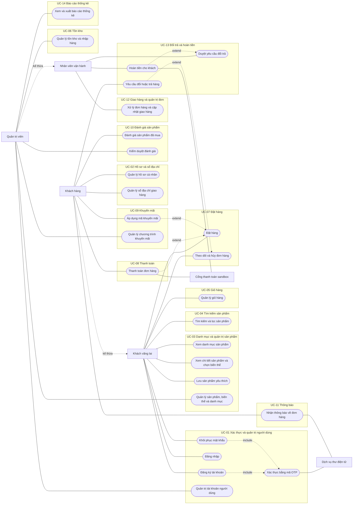
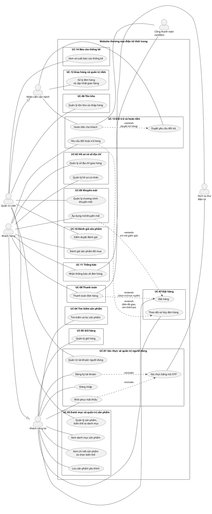

# Use Case Diagram — Website thương mại điện tử thời trang

> Bản duyệt v1.0, ngày 13/09/2026. Mã phân hệ khớp với bảng chia việc theo sprint trong [kho docs](https://github.com/F-R-E-Y-A/docs/blob/main/ke-hoach/ChiaViecTheoSprint_TLCN.docx).
>
> **Cách xem:** cài extension `Markdown Preview Mermaid Support` trong VS Code, rồi bấm `Ctrl+Shift+V`. Bản PlantUML ở cuối tệp dùng cho báo cáo, cài extension `PlantUML` nếu muốn xem.

---

## 1. Sơ đồ Mermaid (xem nhanh)

---

## 2. Bảng ánh xạ use case sang phân hệ và người phụ trách

Cột phân hệ và sprint lấy đúng từ bảng phân công công việc, để hai tài liệu tra chéo được.

| Mã use case | Tên use case | Tác nhân chính | Phân hệ | Người | Sprint | Mức |
|---|---|---|---|---|---|---|
| UC-01.1 | Đăng ký tài khoản | Khách vãng lai | UC-01 | Tài | S2 | Phải có |
| UC-01.2 | Đăng nhập | Khách vãng lai | UC-01 | Tài | S2 | Phải có |
| UC-01.3 | Khôi phục mật khẩu | Khách vãng lai | UC-01 | Tài | S2 | Nên có |
| UC-01.4 | Xác thực bằng mã OTP | Khách vãng lai, Dịch vụ thư | UC-01 | Tài | S2 | Phải có |
| UC-01.5 | Quản trị tài khoản người dùng | Quản trị viên | UC-01 | Tài | S3 | Phải có |
| UC-02.1 | Quản lý hồ sơ cá nhân | Khách hàng | UC-02 | Tài | S4 | Phải có |
| UC-02.2 | Quản lý sổ địa chỉ giao hàng | Khách hàng | UC-02 | Tài | S4 | Phải có |
| UC-03.1 | Xem danh mục sản phẩm | Khách vãng lai | UC-03 | Bảo | S2 | Phải có |
| UC-03.2 | Xem chi tiết sản phẩm và chọn biến thể | Khách vãng lai | UC-03 | Bảo | S4 | Phải có |
| UC-03.3 | Lưu sản phẩm yêu thích | Khách vãng lai | UC-03 | Bảo | S4 | Nên có |
| UC-03.4 | Quản lý sản phẩm, biến thể và danh mục | Quản trị viên | UC-03 | Bảo | S4 | Phải có |
| UC-04.1 | Tìm kiếm và lọc sản phẩm | Khách vãng lai | UC-04 | Bảo | S3, S8 | Phải có |
| UC-05.1 | Quản lý giỏ hàng | Khách vãng lai | UC-05 | Duy | S2, S3 | Phải có |
| UC-06.1 | Quản lý tồn kho và nhập hàng | Quản trị viên | UC-06 | Duy | S4 | Phải có |
| UC-07.1 | Đặt hàng | Khách vãng lai | UC-07 | Duy | S5 | Phải có |
| UC-07.2 | Theo dõi và hủy đơn hàng | Khách vãng lai | UC-07 | Duy | S6 | Phải có |
| UC-08.1 | Thanh toán đơn hàng | Khách hàng, Cổng thanh toán | UC-08 | Bảo | S6, S7 | Phải có |
| UC-09.1 | Áp dụng mã khuyến mãi | Khách hàng | UC-09 | Duy | S7 | Phải có |
| UC-09.2 | Quản lý chương trình khuyến mãi | Quản trị viên | UC-09 | Duy | S7 | Phải có |
| UC-10.1 | Đánh giá sản phẩm đã mua | Khách hàng | UC-10 | Tài | S5 | Phải có |
| UC-10.2 | Kiểm duyệt đánh giá | Quản trị viên | UC-10 | Tài | S5 | Nên có |
| UC-11.1 | Nhận thông báo về đơn hàng | Khách hàng, Dịch vụ thư | UC-11 | Bảo | S9 | Phải có |
| UC-12.1 | Xử lý đơn hàng và cập nhật giao hàng | Nhân viên vận hành | UC-12 | Duy | S8 | Phải có |
| UC-13.1 | Yêu cầu đổi hoặc trả hàng | Khách hàng | UC-13 | Tài | S7 | Phải có |
| UC-13.2 | Duyệt yêu cầu đổi trả | Nhân viên vận hành | UC-13 | Tài | S7 | Phải có |
| UC-13.3 | Hoàn tiền cho khách | Nhân viên vận hành, Cổng thanh toán | UC-13 | Tài | S8 | Phải có |
| UC-14.1 | Xem và xuất báo cáo thống kê | Quản trị viên | UC-14 | Tài | S6 | Phải có |

**Tổng: 27 use case, 14 phân hệ.** Theo người: Bảo 8 use case, Duy 6, Tài 13. Tài nhiều use case nhỏ, Bảo và Duy ít use case nhưng mỗi cái kéo dài hai tuần, nên ngày công vẫn bằng nhau ở mức 66.

---

## 3. Quan hệ giữa các use case

| Quan hệ | Loại | Điều kiện | Vì sao |
|---|---|---|---|
| Đăng ký tài khoản → Xác thực bằng mã OTP | include | Luôn thực hiện | Không xác thực email thì không tạo được tài khoản. Hành vi này dùng lại ở hai chỗ nên tách ra là đúng nghĩa include |
| Khôi phục mật khẩu → Xác thực bằng mã OTP | include | Luôn thực hiện | Cùng một hành vi, dùng lại |
| Thanh toán đơn hàng ⇢ Đặt hàng | extend | Khách chọn trả trực tuyến | Hệ thống có thanh toán khi nhận hàng, nên đơn vẫn tạo được mà không thanh toán. Dùng include ở đây là sai |
| Áp dụng mã khuyến mãi ⇢ Đặt hàng | extend | Khách nhập mã hợp lệ | Không phải đơn nào cũng có mã giảm |
| Yêu cầu đổi hoặc trả hàng ⇢ Theo dõi và hủy đơn hàng | extend | Đơn đã giao và còn trong thời hạn đổi trả | Khách vào trang theo dõi đơn rồi mới tạo yêu cầu |
| Hoàn tiền cho khách ⇢ Duyệt yêu cầu đổi trả | extend | Duyệt trả hàng, không áp dụng khi đổi kích thước | Đổi kích thước thì không hoàn tiền, yêu cầu bị từ chối cũng không hoàn |

**Vì sao chỉ có hai include.** Include nghĩa là use case gốc luôn thực hiện hành vi được gộp, và hành vi đó thường dùng lại ở nhiều nơi. Hệ thống này ít chỗ như vậy. Những thứ trông giống include mà thực ra không phải: đặt hàng đọc giỏ hàng là phụ thuộc dữ liệu, giữ tồn kho khi đặt hàng là hành vi nội bộ hệ thống, kiểm tra đã mua khi đánh giá là điều kiện tiên quyết. Ba thứ đó viết trong đặc tả use case, không vẽ thành quan hệ.

---

## 4. Ghi chú phạm vi

**Không vẽ thành use case vì là hành vi nội bộ hệ thống, sẽ mô tả trong đặc tả và trong lược đồ tuần tự:** giữ tồn kho có thời hạn khi đặt hàng, hoàn kho tự động khi hết hạn, xử lý thông báo lặp từ cổng thanh toán, đối soát giao dịch theo lịch, cập nhật chỉ mục tìm kiếm, ghi nhật ký thao tác quản trị.

**Ngoài phạm vi, đã thống nhất với giảng viên:** tồn kho theo cửa hàng và nhận hàng tại cửa hàng, chương trình khách hàng thân thiết, sàn nhiều người bán, thanh toán thật ngoài môi trường thử nghiệm, kết nối đơn vị vận chuyển thật. Nhân viên vận hành cập nhật trạng thái giao hàng thủ công.

**Bốn tác nhân:** Khách vãng lai, Khách hàng kế thừa Khách vãng lai, Nhân viên vận hành, Quản trị viên kế thừa Nhân viên vận hành. Hai hệ thống ngoài: cổng thanh toán môi trường thử nghiệm và dịch vụ thư điện tử.

**Đặt hàng và theo dõi đơn nối với Khách vãng lai**, không phải Khách hàng, vì hệ thống cho phép mua không cần tài khoản và tra đơn bằng mã đơn kèm thư điện tử. Khách hàng kế thừa nên vẫn dùng được.

---

## 5. Bản PlantUML cho báo cáo

Đặt tệp này vào `docs/ba/use-case-diagram.puml` khi dựng kho mã ở Sprint 1.

---

## 6. Khác gì so với bản nháp trước

| Đã sửa | Chi tiết |
|---|---|
| Mã use case | Đánh lại theo phân hệ để khớp bảng phân công và cây `docs/ba/uc-NN.md` |
| Quan hệ | Bỏ bốn quan hệ sai, thêm hai include đúng nghĩa và bốn extend có điều kiện |
| Thiếu chức năng | Thêm quản lý tồn kho và nhập hàng, quản lý chương trình khuyến mãi, kiểm duyệt đánh giá, khôi phục mật khẩu |
| Tác nhân | Đăng ký và đăng nhập chuyển sang Khách vãng lai; đặt hàng và theo dõi đơn cũng sang Khách vãng lai vì có mua không cần tài khoản; tách yêu cầu đổi trả của khách khỏi duyệt đổi trả của nhân viên |
| Tên use case | Bỏ hết chi tiết kỹ thuật và giải pháp: đa diện, giữ chỗ tồn kho, qua cổng trực tuyến, thời gian thực và email, xác thực, tính giá, đối soát, nhật ký |
