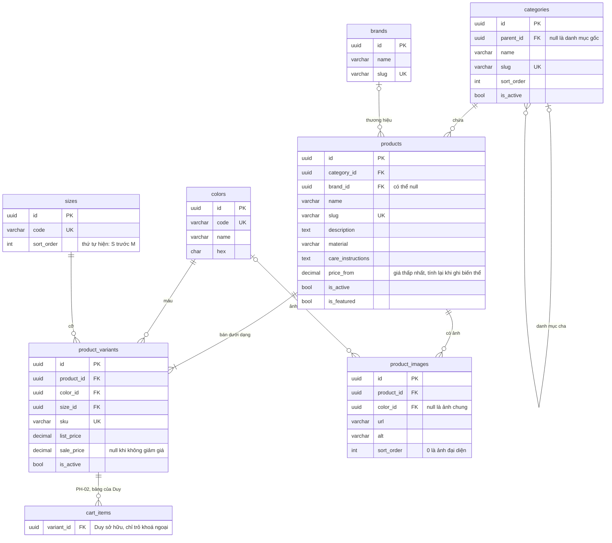

# Dữ liệu của feature sản phẩm

**Chức năng:** Bảy bảng Bảo sở hữu cho PH-01: quan hệ, từng cột, ràng buộc, chỉ mục, và chỗ bảng của người khác trỏ vào.

Mô hình theo [ADR-007](LOG.md#adr-007): **biến thể là đơn vị bán** (một mã hàng, một giá), **màu, cỡ, thương hiệu là bảng tra cứu**. Tài ghép phần này vào sơ đồ tổng ở [shared/data-model.md](../../shared/data-model.md); quy ước đặt tên ở cùng tệp đó. Khi `catalog.prisma` cài xong, **lược đồ Prisma là sự thật**, tệp này phải khớp nó.

## Sơ đồ

Mọi bảng có thêm `created_at`, `updated_at` (`timestamptz`), không vẽ cho gọn.

## Từ điển dữ liệu

Kiểu ghi theo PostgreSQL. Tiền `decimal(12,2)`, trả ra API dạng chuỗi ([shared/code.md](../../shared/code.md) luật 1).

### `categories` — danh mục, cây cha con

| Cột | Kiểu | Bắt buộc | Mặc định | Ý nghĩa, ràng buộc |
|---|---|---|---|---|
| `id` | `uuid` | có | sinh tự động | Khoá chính |
| `parent_id` | `uuid` | không | `null` | Khoá ngoại tới `categories.id`, `ON DELETE RESTRICT`: không xoá được danh mục còn con |
| `name` | `varchar(120)` | có | | Tên hiện ra, ví dụ "Áo thun" |
| `slug` | `varchar(140)` | có | | Duy nhất; dùng trên đường dẫn `/danh-muc/:slug` |
| `sort_order` | `int` | có | `0` | Thứ tự trên menu, nhỏ trước; `CHECK (sort_order >= 0)` |
| `is_active` | `boolean` | có | `true` | `false` thì ẩn danh mục và sản phẩm của nó khỏi cửa hàng |

### `brands` — thương hiệu

| Cột | Kiểu | Bắt buộc | Mặc định | Ý nghĩa, ràng buộc |
|---|---|---|---|---|
| `id` | `uuid` | có | sinh tự động | Khoá chính |
| `name` | `varchar(120)` | có | | Tên hiện ra |
| `slug` | `varchar(140)` | có | | Duy nhất; khoá khớp khi nạp dữ liệu |

### `products` — sản phẩm

| Cột | Kiểu | Bắt buộc | Mặc định | Ý nghĩa, ràng buộc |
|---|---|---|---|---|
| `id` | `uuid` | có | sinh tự động | Khoá chính |
| `category_id` | `uuid` | có | | Khoá ngoại tới `categories.id`, `ON DELETE RESTRICT` |
| `brand_id` | `uuid` | không | `null` | Khoá ngoại tới `brands.id`, `ON DELETE SET NULL` |
| `name` | `varchar(200)` | có | | Tên sản phẩm |
| `slug` | `varchar(220)` | có | | Duy nhất; đường dẫn `/san-pham/:slug` và khoá khớp khi nạp dữ liệu |
| `description` | `text` | không | | Mô tả |
| `material` | `varchar(200)` | không | | Chất liệu (UC-03.4 bước 2) |
| `care_instructions` | `text` | không | | Hướng dẫn bảo quản (UC-03.4 bước 2) |
| `price_from` | `decimal(12,2)` | có | | Giá bán thấp nhất trong các biến thể đang bán. **Chỉ service `products` ghi**, tính lại trong cùng giao dịch mỗi khi ghi biến thể; nhờ vậy sắp xếp và lọc theo giá không phải gom nhóm |
| `is_active` | `boolean` | có | `true` | `false` là ngừng bán: ẩn khỏi cửa hàng, giỏ báo "ngừng bán" |
| `is_featured` | `boolean` | có | `false` | Hiện ở khối "Nổi bật" trang chủ |

### `product_variants` — biến thể, đơn vị bán

| Cột | Kiểu | Bắt buộc | Mặc định | Ý nghĩa, ràng buộc |
|---|---|---|---|---|
| `id` | `uuid` | có | sinh tự động | Khoá chính. **Giỏ hàng, tồn kho, đơn hàng của Duy trỏ vào cột này** |
| `product_id` | `uuid` | có | | Khoá ngoại tới `products.id`, `ON DELETE RESTRICT` |
| `color_id` | `uuid` | có | | Khoá ngoại tới `colors.id`, `ON DELETE RESTRICT` |
| `size_id` | `uuid` | có | | Khoá ngoại tới `sizes.id`, `ON DELETE RESTRICT` |
| `sku` | `varchar(64)` | có | | Mã hàng, duy nhất; khoá khớp khi nạp dữ liệu |
| `list_price` | `decimal(12,2)` | có | | Giá niêm yết; `CHECK (list_price > 0)` |
| `sale_price` | `decimal(12,2)` | không | `null` | Giá khuyến mãi; `CHECK (sale_price IS NULL OR (sale_price > 0 AND sale_price < list_price))` |
| `is_active` | `boolean` | có | `true` | Biến thể ngừng bán vẫn giữ để giỏ và đơn cũ không gãy |

Duy nhất theo bộ `(product_id, color_id, size_id)`: một sản phẩm không có hai biến thể cùng màu cùng cỡ.

### `product_images` — ảnh

| Cột | Kiểu | Bắt buộc | Mặc định | Ý nghĩa, ràng buộc |
|---|---|---|---|---|
| `id` | `uuid` | có | sinh tự động | Khoá chính |
| `product_id` | `uuid` | có | | Khoá ngoại tới `products.id`, `ON DELETE CASCADE`: ảnh không có ai khác trỏ vào |
| `color_id` | `uuid` | không | `null` | Ảnh của màu nào; `null` là ảnh dùng cho mọi màu. `ON DELETE SET NULL` |
| `url` | `varchar(500)` | có | | Địa chỉ ảnh |
| `alt` | `varchar(200)` | không | | Mô tả ảnh cho trình đọc màn hình ([shared/design.md](../../shared/design.md) luật 3) |
| `sort_order` | `int` | có | `0` | Thứ tự trong thư viện ảnh; nhỏ nhất là ảnh đại diện; `CHECK (sort_order >= 0)` |

### `colors`, `sizes` — bảng tra cứu

| Bảng | Cột | Ý nghĩa, ràng buộc |
|---|---|---|
| `colors` | `code varchar(40)` duy nhất, `name varchar(40)`, `hex char(7)` | `code` không dấu làm khoá khớp và tham số lọc (`den`, `trang`); `name` hiện ra ("Đen"); `hex` vẽ ô màu, `CHECK (hex ~ '^#[0-9A-Fa-f]{6}$')` |
| `sizes` | `code varchar(20)` duy nhất, `sort_order int` | `code` hiện ra và làm tham số lọc (`S`, `M`, `29`, `FREE`); `sort_order` quyết thứ tự nút cỡ, vì sắp theo chữ sẽ ra `L, M, S, XL` |

## Luật dữ liệu

| # | Luật | Canh ở đâu |
|---|---|---|
| 1 | Không xoá cứng sản phẩm và biến thể, chỉ đặt `is_active = false`. Giỏ và đơn của Duy trỏ vào biến thể, xoá cứng là gãy lịch sử đơn | `ON DELETE RESTRICT` ở `product_variants.product_id`; service không có hàm xoá |
| 2 | Sản phẩm chỉ hiện ở cửa hàng khi chính nó, danh mục của nó và ít nhất một biến thể đang bán (UC-03.1/BR1) | Truy vấn liệt kê |
| 3 | `price_from` bằng giá bán nhỏ nhất (`sale_price` nếu có, không thì `list_price`) trong các biến thể đang bán | Service `products`, cùng giao dịch với lần ghi biến thể |
| 4 | Bảng của người khác chỉ **trỏ khoá ngoại** vào đây, không ghi; muốn đọc thì gọi hàm công bố trong [README của module](../../../apps/api/src/modules/products/README.md) | Luật 2 của [CONTRIBUTING.md](../../CONTRIBUTING.md) |

Prisma không mô tả được `CHECK`, nên các ràng buộc `CHECK` ở trên viết tay vào tệp SQL của migration, kèm chú thích dẫn về đây.

## Chỉ mục

| Chỉ mục | Phục vụ |
|---|---|
| `products (category_id)` | Liệt kê theo danh mục |
| `products (is_active, created_at DESC)` | Sắp xếp mới nhất, mặc định của mọi danh sách |
| `products (is_active, price_from)` | Sắp xếp theo giá |
| `product_variants (product_id)`, `product_images (product_id, sort_order)` | Trang chi tiết |
| `categories (parent_id)` | Dựng cây danh mục, lấy danh mục con |

Số đo trước sau của chỉ mục ghi vào LOG khi có dữ liệu thật; chưa đo thì chưa thêm chỉ mục nào ngoài bảng trên.

## Chưa nằm trong PH-01

| Bảng trong đặc tả UC-03 | Khi nào | Vì sao chưa |
|---|---|---|
| `size_guides`, `size_guide_rows` | UC-03.5, mức Nên có | Chưa giao dòng việc |
| `product_relations` | Không cần | Sản phẩm liên quan tính theo cùng danh mục |
| Điểm đánh giá trung bình | Khi Tài làm đánh giá (UC-11) | Đọc qua hàm công bố của Tài, không truy vấn bảng `reviews` |
| Tồn kho khả dụng | Khi Duy làm tồn kho (UC-13) | Đọc qua hàm công bố của Duy theo `variant_id` |
