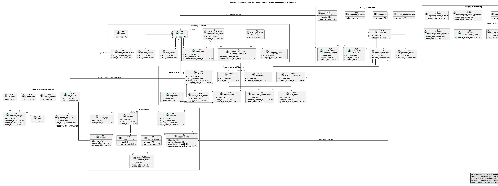

# Sơ đồ: đặt ở đâu, vẽ bằng gì

**Chức năng:** Sơ đồ nghiệp vụ và thiết kế đặt ở đâu, dùng định dạng nào, và ba luật để sơ đồ khớp mã khi hội đồng đối chiếu.

Sơ đồ nằm trong **kho mã** chứ không ở kho tài liệu, vì chúng phải sửa cùng pull request với mã; tách hai kho thì lệch nhau sau vài tuần.

## Cái gì để đâu

| Sơ đồ | Đặt ở | Ai giữ |
|---|---|---|
| Use case tổng quan | `shared/diagrams/uc-tong-quan.drawio.png`, chữ ở `uc-tong-quan.md` (đang ở pull request #9) | Duy |
| Quan hệ thực thể tổng | `shared/diagrams/erd-tong-the.drawio.png`, từ điển ở [data-model.md](../data-model.md) | Tài |
| Hoạt động, tuần tự của một luồng | `features/<x>/<loại>-<tên>.drawio.png`, nhúng vào README hoặc use-cases của feature | Người sở hữu luồng |

Sơ đồ dùng chung cả hệ thống thì ở đây; sơ đồ của một feature thì nằm trong thư mục feature đó. Nhúng ảnh vào tệp `.md` tương ứng:

```markdown

```

## Vì sao dùng đuôi `.drawio.png`

Tệp `.drawio.png` **vừa là ảnh PNG thật vừa là tệp nguồn**:

- GitHub hiện ảnh ngay trong trang, người duyệt pull request thấy sơ đồ mà không phải tải về.
- Mở lại bằng draw.io là sửa được tiếp, không cần giữ thêm tệp nguồn riêng.
- Dán thẳng vào báo cáo Word được.

Một tệp nên **ảnh và nguồn không bao giờ lệch nhau**, lỗi hay gặp khi giữ `.drawio` và `.png` thành hai tệp. Dùng công cụ khác thì giữ cả nguồn lẫn ảnh cùng tên, ví dụ `erd-tong-the.puml` và `erd-tong-the.png`, sửa cái nào thì xuất lại cái kia trong cùng pull request. Mermaid viết thẳng trong `.md` cũng được, GitHub tự vẽ.

## Ba luật khi vẽ

**1. Mã trên sơ đồ theo bảng hệ mã trong `AGENTS.md`.** Use case ghi `UC-NN.m`, không ghi mã dòng việc `PH-NN`, vì một dòng việc gồm nhiều use case và đổi theo tuần.

**2. Sơ đồ phải khớp mã nguồn.** Rubric TC2.1 mức cao nhất đòi khớp 100% khi hội đồng đối chiếu ngẫu nhiên. Tên bảng trên sơ đồ quan hệ thực thể phải đúng tên trong `apps/api/prisma/schema/*.prisma`. Đổi lược đồ thì sửa sơ đồ trong cùng pull request.

**3. Đặc tả use case chia theo feature, không gom một tệp chung.** Mỗi feature một `use-cases.md`, để hai người sửa hai feature không đụng nhau khi gộp.
